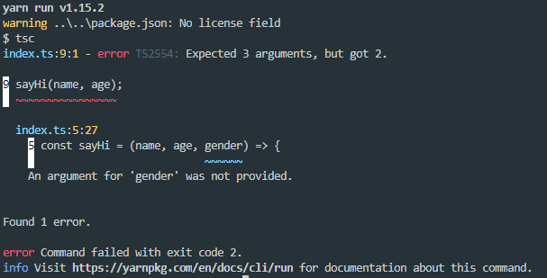

# typechain

Learning Typescript by making a Blockchain with it

## Configuration

### tsconfig.json 파일 생성

- [`node.js`](https://nodejs.org/ko/)는 [`TpyeScript`](https://www.typescriptlang.org/)를 이해하지 못하기 때문에 `JaveScript` 코드로 컴파일하는 작업이 필요하다.

```json
{
  "compilerOptions": {
    "module": "commonjs",
    "target": "ES2015",
    "sourceMap": true
  },
  "include": ["index.ts"],
  "exclude": ["node-modules"]
}
```

### 컴파일 옵션

- **module:** [`node.js`](https://nodejs.org/ko/)를 평범하게 사용하고 다양한 걸 `import`하거나 `export`할 수 있게 만드는 것.
- **target:** 어떤 버전의 자바스크립트로 컴파일 시킬 것인지 적음.
- **sourceMap:** `true`로 설정해서 sourcemap 처리를 할 것인지 알려줌.

### 컴파일 과정

- **include:** `index.ts`를 생성하고 추가.
- **exclude:** `node-modules`를 추가. (디폴트로 제외하는 것이 좋음)

## TypeScript의 시작

```sh
tsc
```

- **tsc:** 터미널에서 tsc를 입력. `index.ts`의 코드를 컴파일해서 `index.js`/`index.js.map`을 만들어 준다.

```json
"scripts": {
    "start": "node index.js",
    "prestart": "tsc"
  }
```

> `tsc` 명령어 대신 `yarn start`를 사용하기 때문에 package.json을 다음과 같이 설정한다.

### TypeScript의 마법

#### Typed

- 어떤 종류의 변수와 데이터인지 설정해줘야 한다.

```sh
string, boolean, number[array]
```

#### TypeScript의 기능

- TypeScript에서 변수와 함수를 생성하여 매개변수 값을 넘겨준다.

```ts
const name = "Suwan",
  age = 24,
  gender = "male";

const sayHi = (name, age, gender) => {
  console.log(`Hello ${name}, you are ${age}, you are a ${gender}`);
};

sayHi(name, age, gender);
```

위 `sayHi` 함수의 arguments `gender`를 제거하고 다시 실행을 해보면 아래와 같은 에러가 발생한다.

[]

이 에러를 해석해보면, `나는 3개의 args가 올 것을 예상했지만, 2개 밖에 얻지 못했어. 그래서 난 이 함수를 실행하지 않을거야!` 라는 뜻이다.
